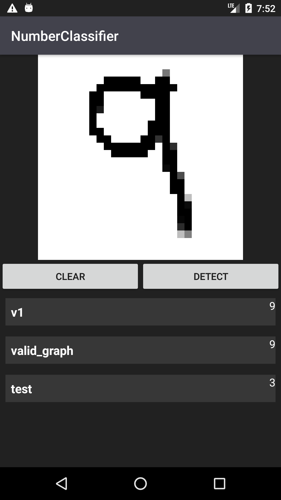
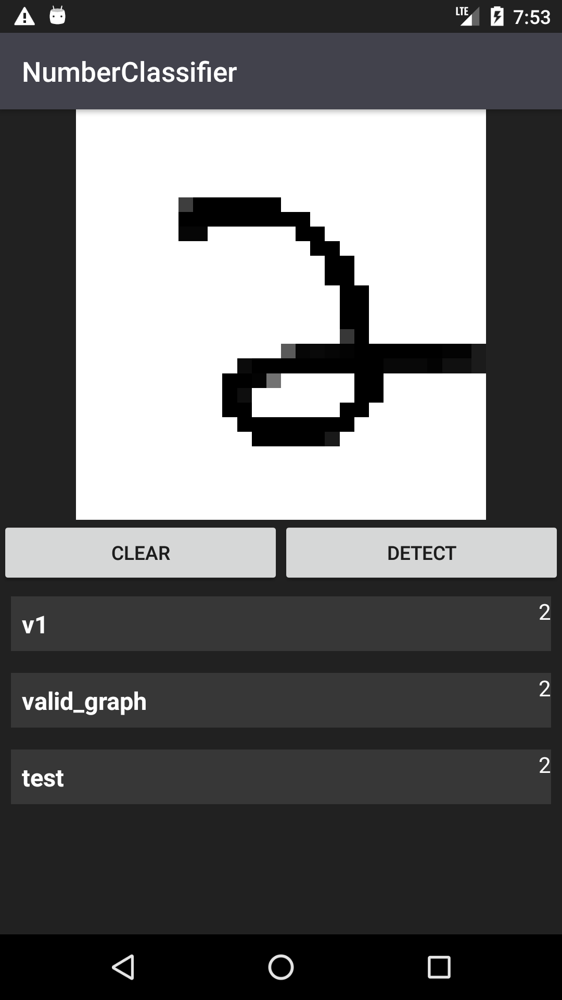

# Number Classifier
Basic demo showing how to include and run a custom
TensorFlow model.

|   |   |

Created a Classifier class to help speed up adding new models.
The classifier interface and abstract class can be extended
to use **any** method of classifying, not necessarily TensorFlow
or even **machine learning** classification.

## Note
The v1 model is based on the **no pooling** CNN.

The classification is sometimes off and I believe this has
to do with the way we pull the pixels from the Android
Bitmap.
* Color values: Model was trained with gray scale (1 dimension)
* Shape: Model was trained with a [1, 784] single array that gets reshaped
to a 28 x 28. In this app I do the **reshaping** on the device and just pass
a 28 x 28 image to the classifier. 

The closer I can get the user input (drawn on image view) to the 
input data that the model was trained on then the classification results should be better.
(Or try to see if the models are **too** **over-fit** to the input data)